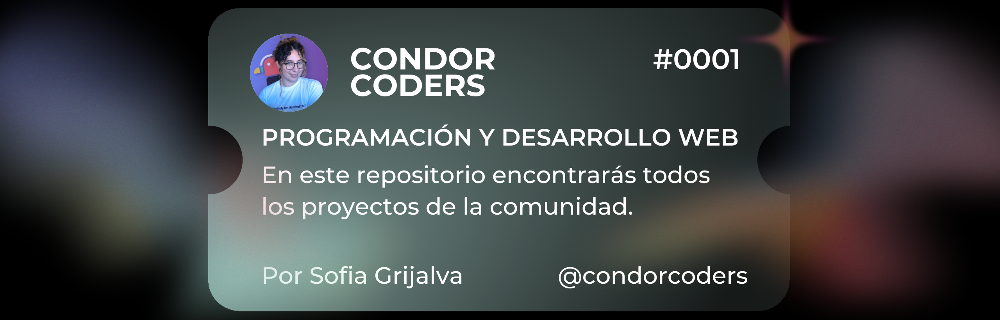

#  Bienvenid@ al GitHub de Condor Coders

Comunidad dedicada a aprender y compartir conocimientos en programación y tecnología. Estamos aquí para aprender juntos, compartir experiencias, resolver desafíos y ayudar a cada miembro para que alcance sus metas.

## Tecnologias 💻

 

 

## Las estadisticas del repositorio
 

## Mis ultimos videos de Youtube
<!-- BEGIN YOUTUBE-CARDS -->

<!-- END YOUTUBE-CARDS -->
